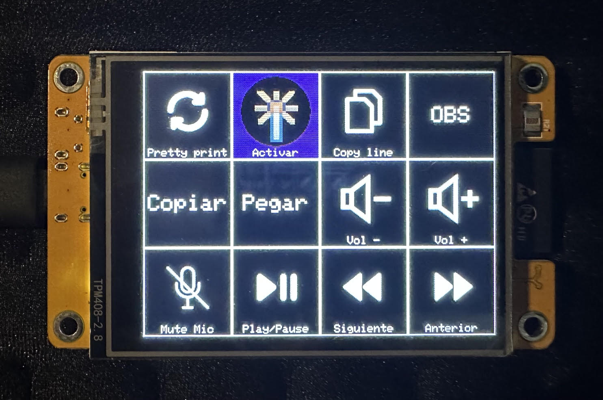

# CYD Command Deck - Complete Documentation

**Transform your ESP32-Cheap-Yellow-Display into a functional Command Deck like Stream Deck**

---

## Table of Contents

1. Project Description
2. System Architecture
3. Requirements
4. Installation and Configuration
5. User Guide
6. Command Reference
7. Icon Creation
8. Technical Documentation
9. User_Setup.h Configuration
10. Troubleshooting
11. Advanced Customization

---

## Project Description

This project converts the ESP32-2432S028 board (known as CYD - Cheap Yellow Display) into a programmable macro controller similar to an Stream Deck, communicating with Windows via USB/Serial.

### Features
- 12 programmable buttons (4x3 grid)
- 2.8" color touch screen (320x240)
- Customizable icons from SD card
- Dynamic configuration without reprogramming the ESP32
- Macro execution, keyboard shortcuts, and application launching
- Bidirectional communication via JSON over serial port
- Smart SPI bus management (SD and touch don't share SPI simultaneously)

---

## System Architecture

    +-----------------------------------------------------------------+
    |                         CYD (ESP32)                             |
    |                                                                 |
    |  +--------------+    +----------------+    +--------------+     |
    |  |   Display    |    |  Controller    |    |  MicroSD     |     |
    |  |   ST7789     |<-->|     SPI        |<-->|  (icons)     |     |
    |  |  320x240     |    |  (HSPI)        |    |              |     |
    |  +--------------+    +-------+--------+    +--------------+     |
    |                              |                                  |
    |  +--------------+    +-------v--------+                         |
    |  |   Touch      |    |  Controller    |                         |
    |  |  XPT2046     |<-->|     SPI        |                         |
    |  |              |    |  (VSPI)        |                         |
    |  +--------------+    +----------------+                         |
    |                              |                                  |
    +------------------------------|----------------------------------+
                                   | USB/Serial (JSON)
                                   v
                        +---------------------+
                        |    Windows PC       |
                        |   cyd_deck.py       |
                        |                     |
                        |  +---------------+  |
                        |  |  pyautogui    |  |
                        |  |  (keys)       |  |
                        |  +---------------+  |
                        +---------------------+

### Important Consideration: SPI Bus Management

The CYD has a hardware peculiarity: the display, touch, and SD share the same SPI bus. This means they cannot operate simultaneously.

Implemented solution:
1. Display: Uses HSPI bus (dedicated pins)
2. SD and Touch: Alternate on VSPI bus
3. Smart flow:
   - When receiving configuration -> initialize SD -> read icons -> close SD (SD.end())
   - Then initialize touch on a second SPI bus (VSPI)
   - Touch remains active to detect presses

---

## Requirements

### Hardware
- ESP32-2432S028 board (CYD)
- MicroSD card formatted in FAT32 (recommended)
- USB-C or Micro-USB cable (depending on your board)
- PC with Windows

### Software
- Arduino IDE or PlatformIO
- Python 3.7+ on Windows
- Arduino libraries:
  - TFT_eSPI
  - XPT2046_Touchscreen
  - ArduinoJson (v6 or v7)
- Python packages:
    pip install pyserial pyautogui

---

## Installation and Configuration

### Step 1: Configure TFT_eSPI for CYD

Important: Without this, the display won't work.

1. Go to: C:\Users\[YOUR_USER]\Documents\Arduino\libraries\TFT_eSPI\
2. Open User_Setup.h and replace ALL its content with the file provided in the "User_Setup.h Configuration" section
3. Save the file and restart Arduino IDE

### Step 2: Prepare the SD Card

1. Format the card in FAT32 (allocation size: 4096 bytes)
2. Create an /icons/ folder in the root
3. Copy your BMP icons (see "Icon Creation" section)

### Step 3: Upload Firmware to CYD

1. Open Arduino IDE
2. Install required libraries from Library Manager
3. Copy the firmware code cyd_deck.ino (see Technical Documentation)
4. Select:
   - Board: ESP32 Dev Module
   - Port: COMx (whichever applies)
5. Upload the sketch

### Step 4: Configure Python on Windows

1. Install Python from https://python.org
2. Open CMD or PowerShell and run:
    pip install pyserial pyautogui
3. Create a file cyd_deck.py with the host code (see Technical Documentation)
4. Edit the COM port in the line:
    ser = serial.Serial('COM3', 115200, timeout=1)  # <- Change COM3 to your port
5. Run as Administrator (required to send keys to some apps):
    python cyd_deck.py

---

## User Guide

### Button Configuration

Edit the CONFIG dictionary in cyd_deck.py:

    CONFIG = {
        "buttons": [
            {
                "id": 0,                    # Button ID (0-11)
                "label": "Mute Mic",        # Text on the button
                "color": "#FF0000",         # Background color (hex)
                "icon": "/icons/mute.bmp",  # Icon path on SD (optional)
                "action": "ctrl+shift+m"    # Action to execute
            },
            # ... more buttons
        ]
    }

### Button IDs

    +-----+-----+-----+-----+
    |  0  |  1  |  2  |  3  |  <- Row 0
    +-----+-----+-----+-----+
    |  4  |  5  |  6  |  7  |  <- Row 1
    +-----+-----+-----+-----+
    |  8  |  9  | 10  | 11  |  <- Row 2
    +-----+-----+-----+-----+

### Practical Examples

#### Button for OBS Studio
    {
        "id": 2,
        "label": "OBS",
        "color": "#0000FF",
        "icon": "/icons/obs.bmp",
        "action": "open:obs64.exe"
    }

#### Button to mute microphone (Zoom/Teams/Discord)
    {
        "id": 0,
        "label": "Mute",
        "color": "#FF0000",
        "icon": "/icons/mute.bmp",
        "action": "ctrl+shift+m"
    }

#### Button for volume control
    {
        "id": 6,
        "label": "Vol -",
        "color": "#A52A2A",
        "icon": "/icons/vol_down.bmp",
        "action": "volumedown"
    }

#### Button to open browser
    {
        "id": 3,
        "label": "Chrome",
        "color": "#FFFF00",
        "icon": "/icons/chrome.bmp",
        "action": "open:chrome.exe"
    }

---

## Command Reference

### Keyboard Shortcuts

Use the format "key1+key2+key3":

| Combination              | Syntax                    | Common use             |
|--------------------------|---------------------------|------------------------|
| Ctrl + C                 | "ctrl+c"                  | Copy                   |
| Ctrl + V                 | "ctrl+v"                  | Paste                  |
| Ctrl + Z                 | "ctrl+z"                  | Undo                   |
| Ctrl + Shift + M         | "ctrl+shift+m"            | Mute in Zoom/Teams     |
| Ctrl + Shift + V         | "ctrl+shift+v"            | Activate camera        |
| Ctrl + Shift + T         | "ctrl+shift+t"            | Reopen tab             |
| Alt + F4                 | "alt+f4"                  | Close window           |
| Alt + Tab                | "alt+tab"                 | Switch window          |
| Win + D                  | "win+d"                   | Show desktop           |
| Win + E                  | "win+e"                   | File Explorer          |
| Win + L                  | "win+l"                   | Lock PC                |
| Win + R                  | "win+r"                   | Run dialog             |
| Shift + F1               | "shift+f1"                | Context help           |
| Ctrl + F5                | "ctrl+f5"                 | Refresh (no cache)     |
| Ctrl + Shift + Esc       | "ctrl+shift+escape"       | Task Manager           |

### Function Keys

| Key   | Syntax   |
|-------|----------|
| F1    | "f1"     |
| F2    | "f2"     |
| F3    | "f3"     |
| F4    | "f4"     |
| F5    | "f5"     |
| F6    | "f6"     |
| F7    | "f7"     |
| F8    | "f8"     |
| F9    | "f9"     |
| F10   | "f10"    |
| F11   | "f11"    |
| F12   | "f12"    |

### Multimedia Keys

| Action           | Syntax         |
|------------------|----------------|
| Volume down      | "volumedown"   |
| Volume up        | "volumeup"     |
| Mute             | "volumemute"   |
| Play/Pause       | "playpause"    |
| Next track       | "nexttrack"    |
| Previous track   | "prevtrack"    |

### Special Keys

| Key              | Syntax         |
|------------------|----------------|
| Enter            | "enter"        |
| Escape           | "escape"       |
| Tab              | "tab"          |
| Space            | "space"        |
| Backspace        | "backspace"    |
| Delete           | "delete"       |
| Insert           | "insert"       |
| Home             | "home"         |
| End              | "end"          |
| Page Up          | "pageup"       |
| Page Down        | "pagedown"     |
| Arrow up         | "up"           |
| Arrow down       | "down"         |
| Arrow left       | "left"         |
| Arrow right      | "right"        |

### Open Applications

Format: "open:executable_name.exe"

    "open:obs64.exe"           # OBS Studio
    "open:chrome.exe"          # Google Chrome
    "open:firefox.exe"         # Mozilla Firefox
    "open:notepad.exe"         # Notepad
    "open:calc.exe"            # Calculator
    "open:mspaint.exe"         # Paint
    "open:explorer.exe"        # File Explorer
    "open:discord.exe"         # Discord
    "open:spotify.exe"         # Spotify

---

## Icon Creation

### Technical Specifications

Icons MUST meet these requirements:

1. Format: BMP (Windows Bitmap)
2. Resolution: Exactly 64x64 pixels
3. Color depth: 24 bits (RGB, no alpha channel)
4. Compression: None (uncompressed)
5. Maximum size: ~12 KB per icon

### Method 1: Using Paint (Windows)

1. Open Paint
2. Paste or draw your image
3. Go to File -> Resize
4. Select Pixels and uncheck "Maintain aspect ratio"
5. Enter 64 in Width and 64 in Height
6. Go to File -> Save as -> 24-bit Bitmap
7. Name the file (e.g., mute.bmp)

### Method 2: Using GIMP (Free)

1. Open GIMP
2. Open your image
3. Image -> Scale Image
4. Enter 64x64 pixels
5. File -> Export As
6. Choose .bmp extension
7. In export options:
   - Specify bitmap type
   - Select: RGB (24-bit)
   - Don't check "RLE compression"
8. Export

### Method 3: Using Python (Automatic)

Create a script convert_icons.py:

    from PIL import Image
    import os

    def convert_to_bmp(input_file, output_file):
        """Convert any image to 64x64 24-bit BMP"""
        img = Image.open(input_file)
        img = img.resize((64, 64), Image.Resampling.LANCZOS)
        # Convert to RGB (remove alpha channel if exists)
        if img.mode == 'RGBA':
            # Create white background
            background = Image.new('RGB', (64, 64), (255, 255, 255))
            background.paste(img, mask=img.split()[3])  # Use alpha as mask
            img = background
        elif img.mode != 'RGB':
            img = img.convert('RGB')
        
        img.save(output_file, 'BMP', format='BMP')
        print(f"Converted: {input_file} -> {output_file}")

    # Convert all PNG/JPG from a folder
    input_folder = "original_icons"
    output_folder = "icons"

    os.makedirs(output_folder, exist_ok=True)

    for file in os.listdir(input_folder):
        if file.lower().endswith(('.png', '.jpg', '.jpeg')):
            name_without_ext = os.path.splitext(file)[0]
            input_path = os.path.join(input_folder, file)
            output_path = os.path.join(output_folder, f"{name_without_ext}.bmp")
            convert_to_bmp(input_path, output_path)

Install Pillow: pip install Pillow

### Design Tips

1. Simulated transparent background: Since 24-bit BMP doesn't support transparency, use the same background color as the button color in JSON.

   Example: If your button is red #FF0000, paint the BMP background pure red.

2. High contrast: Use bright colors on dark backgrounds or vice versa for better visibility.

3. Avoid fine details: At 64x64 pixels, small details are lost. Use simple and recognizable icons.

4. Recommended icon palettes:
   - Material Design Icons (https://pictogrammers.com/library/mdi/) (free)
   - FontAwesome (https://fontawesome.com/) (free version)
   - Icons8 (https://icons8.com/) (free with attribution)

### Folder Structure on SD

    / (SD root)
    +-- icons/
    |   +-- mute.bmp
    |   +-- camera.bmp
    |   +-- obs.bmp
    |   +-- chrome.bmp
    |   +-- copy.bmp
    |   +-- paste.bmp
    |   +-- vol_up.bmp
    |   +-- vol_down.bmp
    |   +-- vol_mute.bmp
    |   +-- play.bmp
    |   +-- next.bmp
    |   +-- prev.bmp
    +-- config.json (optional, for backup)

---

## Technical Documentation

### ESP32 Firmware (Arduino) - cyd_deck.ino

#### Required Libraries

    #include <TFT_eSPI.h>           // Display driver
    #include <XPT2046_Touchscreen.h> // Touch driver
    #include <ArduinoJson.h>         // JSON parser
    #include <SD.h>                  // SD card reading
    #include <SPI.h>                 // SPI communication

#### Pin Definition

    // Touch pins (second SPI bus - VSPI)
    #define XPT2046_IRQ  36
    #define XPT2046_MOSI 32
    #define XPT2046_MISO 39
    #define XPT2046_CLK  25
    #define XPT2046_CS   33
    #define TOUCH_CS     33
    #define TOUCH_IRQ    36

    // SD CS pin (shares bus with display)
    #define SD_CS 5

    // Grid configuration
    #define COLS 4
    #define ROWS 3
    #define BTN_W 80
    #define BTN_H 80
    #define ICON_SIZE 64

#### Complete Firmware Code

    #include <TFT_eSPI.h>
    #include <XPT2046_Touchscreen.h>
    #include <ArduinoJson.h>
    #include <SPI.h>
    #include <SD.h>

    // --- CYD PINS ---
    #define XPT2046_IRQ 36
    #define XPT2046_MOSI 32
    #define XPT2046_MISO 39
    #define XPT2046_CLK 25
    #define XPT2046_CS 33
    #define TOUCH_CS 33
    #define TOUCH_IRQ 36
    #define SD_CS 5

    // --- DISPLAY AND GRID CONFIGURATION ---
    #define COLS 4
    #define ROWS 3
    #define BTN_W 80
    #define BTN_H 80
    #define ICON_SIZE 64

    TFT_eSPI tft = TFT_eSPI();
    SPIClass touchscreenSpi = SPIClass(VSPI);
    XPT2046_Touchscreen ts(TOUCH_CS, TOUCH_IRQ);

    struct Button {
      String label;
      String iconPath;
      uint16_t bgColor;
      uint16_t textColor;
    };

    Button buttons[COLS * ROWS];
    unsigned long lastDebounceTime = 0;
    const unsigned long debounceDelay = 250;
    bool escucharSD = false;

    void setup() {
      Serial.begin(115200);
      
      tft.init();
      tft.setRotation(3);
      tft.fillScreen(TFT_BLACK);

      // Initialize default buttons
      for (int i = 0; i < COLS * ROWS; i++) {
        buttons[i].label = "Empty";
        buttons[i].iconPath = "";
        buttons[i].bgColor = TFT_DARKGREY;
        buttons[i].textColor = TFT_WHITE;
      }
      
      drawAllButtons();
      Serial.println("{\"status\":\"ready\"}");
    }

    void loop() {
      if (Serial.available()) {
        String input = Serial.readStringUntil('\n');
        parseConfig(input);
      }
      
      if (escucharSD == true) {
        if (ts.touched()) {
          TS_Point p = ts.getPoint();
          int x = map(p.x, 200, 3800, 0, 320);
          int y = map(p.y, 250, 3850, 0, 240);
          int col = x / BTN_W;
          int row = y / BTN_H;
          
          if (col < COLS && row < ROWS) {
            int btnIndex = (row * COLS) + col;
            if (millis() - lastDebounceTime > debounceDelay) {
              lastDebounceTime = millis();
              Serial.print("{\"type\":\"press\",\"id\":");
              Serial.print(btnIndex);
              Serial.println("}");
            }
          }
        }
      }
    }

    void drawAllButtons() {
      for (int i = 0; i < COLS * ROWS; i++) {
        int col = i % COLS;
        int row = i / COLS;
        drawButton(col, row, i);
      }
    }

    void drawButton(int col, int row, int index) {
      int x = col * BTN_W;
      int y = row * BTN_H;
      
      tft.fillRect(x, y, BTN_W, BTN_H, buttons[index].bgColor);
      tft.drawRect(x, y, BTN_W, BTN_H, TFT_WHITE);
      
      if (buttons[index].iconPath.length() > 0) {
        int iconX = x + (BTN_W - ICON_SIZE) / 2;
        int iconY = y + 4;
        drawBmpFile(buttons[index].iconPath.c_str(), iconX, iconY, ICON_SIZE, ICON_SIZE);
        
        tft.setTextColor(buttons[index].textColor, buttons[index].bgColor);
        tft.setTextSize(1);
        int textWidth = tft.textWidth(buttons[index].label);
        int textX = x + (BTN_W - textWidth) / 2;
        tft.drawString(buttons[index].label, textX, y + 70);
      } else {
        tft.setTextColor(buttons[index].textColor, buttons[index].bgColor);
        tft.setTextSize(2);
        int textWidth = tft.textWidth(buttons[index].label);
        int textX = x + (BTN_W - textWidth) / 2;
        int textY = y + (BTN_H - 16) / 2;
        tft.drawString(buttons[index].label, textX, textY);
      }
    }

    void parseConfig(String jsonStr) {
      DynamicJsonDocument doc(4096);
      DeserializationError error = deserializeJson(doc, jsonStr);
      if (error) return;
      
      if (escucharSD == false) {
        if (!SD.begin(SD_CS)) {
          Serial.println("{\"error\":\"sd_failed\"}");
        } else {
          Serial.println("SD Card initialized.");
        }
      }
      
      if (doc.containsKey("buttons")) {
        JsonArray arr = doc["buttons"];
        for (JsonObject btn : arr) {
          int id = btn["id"];
          if (id >= 0 && id < COLS * ROWS) {
            buttons[id].label = btn["label"].as<String>();
            if (btn.containsKey("icon")) {
              buttons[id].iconPath = btn["icon"].as<String>();
            } else {
              buttons[id].iconPath = "";
            }
            String hexColor = btn["color"].as<String>();
            buttons[id].bgColor = hexToColor(hexColor);
          }
        }
        
        drawAllButtons();
        Serial.println("{\"status\":\"updated\"}");
        
        if (escucharSD == false) {
          SD.end();
          touchscreenSpi.begin(XPT2046_CLK, XPT2046_MISO, XPT2046_MOSI, XPT2046_CS);
          ts.begin(touchscreenSpi);
          ts.setRotation(3);
          escucharSD = true;
        }
      }
    }

    uint16_t hexToColor(String hex) {
      hex.replace("#", "");
      long number = strtol(&hex[0], NULL, 16);
      int r = (number >> 16) & 0xFF;
      int g = (number >> 8) & 0xFF;
      int b = number & 0xFF;
      return tft.color565(r, g, b);
    }

    void drawBmpFile(const char *filename, int16_t x, int16_t y, int16_t w, int16_t h) {
      File bmpFile = SD.open(filename);
      if (!bmpFile) {
        Serial.print("Not found: "); Serial.println(filename);
        return;
      }
      
      if (bmpFile.read() != 'B' || bmpFile.read() != 'M') {
        bmpFile.close();
        return;
      }
      
      bmpFile.seek(10);
      uint32_t dataOffset = bmpFile.read();
      dataOffset |= (uint32_t)bmpFile.read() << 8;
      dataOffset |= (uint32_t)bmpFile.read() << 16;
      dataOffset |= (uint32_t)bmpFile.read() << 24;
      
      bmpFile.seek(dataOffset);
      uint16_t rowSize = (w * 3 + 3) & ~3;
      uint8_t sdbuffer[3 * 80];
      
      for (int row = 0; row < h; row++) {
        bmpFile.read(sdbuffer, rowSize);
        for (int col = 0; col < w; col++) {
          int b = sdbuffer[col * 3];
          int g = sdbuffer[col * 3 + 1];
          int r = sdbuffer[col * 3 + 2];
          uint16_t color = tft.color565(r, g, b);
          tft.drawPixel(x + col, y + (h - 1 - row), color);
        }
      }
      bmpFile.close();
    }

### Windows Host (Python) - cyd_deck.py

#### Complete Host Code

    import serial
    import json
    import time
    import pyautogui
    import subprocess

    CONFIG = {
        "buttons": [
            {"id": 0, "label": "Mute", "color": "#FF0000", "icon": "/icons/mute.bmp", "action": "ctrl+shift+m"},
            {"id": 1, "label": "Cam", "color": "#00FF00", "icon": "/icons/camera.bmp", "action": "ctrl+shift+v"},
            {"id": 2, "label": "OBS", "color": "#0000FF", "icon": "/icons/obs.bmp", "action": "open:obs64.exe"},
            {"id": 3, "label": "Web", "color": "#FFFF00", "icon": "/icons/chrome.bmp", "action": "open:chrome.exe"},
            {"id": 4, "label": "Copy", "color": "#808080", "icon": "/icons/copy.bmp", "action": "ctrl+c"},
            {"id": 5, "label": "Paste", "color": "#808080", "icon": "/icons/paste.bmp", "action": "ctrl+v"},
            {"id": 6, "label": "Vol-", "color": "#A52A2A", "icon": "/icons/vol_down.bmp", "action": "volumedown"},
            {"id": 7, "label": "Vol+", "color": "#A52A2A", "icon": "/icons/vol_up.bmp", "action": "volumeup"},
            {"id": 8, "label": "Mute", "color": "#A52A2A", "icon": "/icons/vol_mute.bmp", "action": "volumemute"},
            {"id": 9, "label": "Play", "color": "#4B0082", "icon": "/icons/play.bmp", "action": "playpause"},
            {"id": 10, "label": "Next", "color": "#4B0082", "icon": "/icons/next.bmp", "action": "nexttrack"},
            {"id": 11, "label": "Prev", "color": "#4B0082", "icon": "/icons/prev.bmp", "action": "prevtrack"}
        ]
    }

    def connect_serial():
        ser = serial.Serial('COM3', 115200, timeout=1)  # <- Change COM3
        time.sleep(2)
        return ser

    def execute_action(action_str):
        try:
            if action_str.startswith("open:"):
                app = action_str.replace("open:", "")
                subprocess.Popen(app)
                print(f"[OK] Opened: {app}")
            elif action_str in ["volumedown", "volumeup", "volumemute", 
                                "playpause", "nexttrack", "prevtrack"]:
                pyautogui.press(action_str)
                print(f"[OK] Multimedia: {action_str}")
            else:
                keys = action_str.split('+')
                pyautogui.hotkey(*keys)
                print(f"[OK] Keys: {action_str}")
        except Exception as e:
            print(f"[ERROR] {action_str}: {e}")

    def main():
        print("Starting CYD Stream Deck...")
        ser = connect_serial()
        
        while True:
            line = ser.readline().decode('utf-8').strip()
            if '"ready"' in line:
                print("CYD connected")
                break
        
        config_json = json.dumps(CONFIG) + '\n'
        ser.write(config_json.encode('utf-8'))
        print("Configuration sent")
        
        while True:
            line = ser.readline().decode('utf-8').strip()
            if '"updated"' in line:
                print("Configuration loaded on CYD")
                break
        
        print("Listening for presses...")
        while True:
            try:
                line = ser.readline().decode('utf-8').strip()
                if line:
                    print(f"[RX] {line}")
                    data = json.loads(line)
                    if data.get("type") == "press":
                        btn_id = data.get("id")
                        action = next(
                            (b["action"] for b in CONFIG["buttons"] if b["id"] == btn_id),
                            None
                        )
                        if action:
                            execute_action(action)
                        else:
                            print(f"[WARN] No action for button {btn_id}")
            except json.JSONDecodeError as e:
                print(f"[JSON ERROR] {e}")
            except KeyboardInterrupt:
                print("\nClosing...")
                ser.close()
                break

    if __name__ == "__main__":
        main()

### Communication Protocol

#### CYD -> PC Messages

    {"status":"ready"}                    // CYD initialized
    {"status":"updated"}                  // Configuration applied
    {"type":"press","id":5}               // Button 5 pressed
    {"error":"sd_failed"}                 // Error: SD not detected
    {"error":"json_parse"}                // Error: Invalid JSON

#### PC -> CYD Messages

    {
      "buttons": [
        {
          "id": 0,
          "label": "Mute",
          "color": "#FF0000",
          "icon": "/icons/mute.bmp"
        }
      ]
    }

### Touch Calibration

If touches are not registered in the correct position:

    // Typical values for CYD (may vary)
    #define X_MIN 200
    #define X_MAX 3800
    #define Y_MIN 250
    #define Y_MAX 3850

    int x = map(p.x, X_MIN, X_MAX, 0, 320);
    int y = map(p.y, Y_MIN, Y_MAX, 0, 240);
    x = constrain(x, 0, 319);
    y = constrain(y, 0, 239);

---

## User_Setup.h Configuration

Complete file for CYD (ESP32-2432S028). Copy this content and replace the User_Setup.h file in your TFT_eSPI library:

    // USER DEFINED SETTINGS
    // Set driver type, fonts to be loaded, pins used and SPI control method etc

    #define USER_SETUP_INFO "User_Setup"

    // ##################################################################################
    // Section 1. Call up the right driver file and any options for it
    // ##################################################################################

    #define ST7789_DRIVER
    #define TFT_RGB_ORDER TFT_BGR

    #define TFT_INVERSION_OFF

    // ##################################################################################
    // Section 2. Define the pins that are used to interface with the display here
    // ##################################################################################

    #define TFT_BL 21
    #define TFT_BACKLIGHT_ON HIGH

    #define TFT_MISO 12
    #define TFT_MOSI 13
    #define TFT_SCLK 14
    #define TFT_CS 15
    #define TFT_DC 2
    #define TFT_RST -1

    // ##################################################################################
    // Section 3. Define the fonts that are to be used here
    // ##################################################################################

    #define LOAD_GLCD
    #define LOAD_FONT2
    #define LOAD_FONT4
    #define LOAD_FONT6
    #define LOAD_FONT7
    #define LOAD_FONT8
    #define LOAD_GFXFF
    #define SMOOTH_FONT

    // ##################################################################################
    // Section 4. Other options
    // ##################################################################################

    #define SPI_FREQUENCY 55000000
    #define SPI_READ_FREQUENCY 20000000
    #define SPI_TOUCH_FREQUENCY 2500000
    #define USE_HSPI_PORT

Pins configured for CYD:
- TFT_MISO: 12
- TFT_MOSI: 13
- TFT_SCLK: 14
- TFT_CS: 15
- TFT_DC: 2
- TFT_RST: -1 (connected to ESP32 RST)
- TFT_BL: 21 (Backlight)
- Driver: ST7789
- Color order: BGR
- SPI frequency: 55 MHz
- SPI bus: HSPI (to free VSPI for touch)

---

## Troubleshooting

### Problem: Blank display

Cause: User_Setup.h misconfigured

Solution:
1. Verify you replaced User_Setup.h with the CYD configuration
2. Restart Arduino IDE completely
3. Recompile and upload

### Problem: Touch not responding

Cause: Incorrect calibration or SPI conflict

Solution:
1. Verify the code uses the second SPI bus for touch:
    SPIClass touchscreenSpi = SPIClass(VSPI);
    touchscreenSpi.begin(XPT2046_CLK, XPT2046_MISO, XPT2046_MOSI, XPT2046_CS);
    ts.begin(touchscreenSpi);
2. Make sure SD.end() is called before initializing touch
3. Adjust X_MIN, X_MAX, Y_MIN, Y_MAX values according to your board

### Problem: Icons not showing

Cause: Incorrect BMP format or SD not initialized

Solution:
1. Verify BMPs are 24-bit uncompressed
2. Verify they are exactly 64x64 pixels
3. Verify the path in JSON matches the SD (e.g., /icons/mute.bmp)
4. Format SD in FAT32 (not exFAT or NTFS)
5. Check Serial Monitor to see if "SD Card initialized." appears

### Problem: Python not executing actions

Cause: Insufficient permissions or incorrect COM port

Solution:
1. Run Python as Administrator
2. Verify COM port in Device Manager
3. Make sure the destination window has focus

### Problem: "Guru Meditation Error"

Cause: Insufficient memory or library conflict

Solution:
1. Reduce DynamicJsonDocument size if too large
2. Update all libraries to latest version
3. Restart the board

### Problem: Conflict between SD and Touch

Cause: Both devices trying to use the same SPI bus simultaneously

Solution:
1. Use current implementation that alternates between SD and touch
2. Make sure to call SD.end() before initializing touch
3. Use a second SPI bus (VSPI) for touch with dedicated pins

---

## Advanced Customization

### Change Grid Size

To use 3x4 (12 buttons) instead of 4x3:

    // In firmware
    #define COLS 3
    #define ROWS 4
    #define BTN_W 106  // 320/3
    #define BTN_H 60   // 240/4

### Add Sound on Touch

Connect a buzzer to pin 25 and add:

    #define BUZZER_PIN 25

    void setup() {
      pinMode(BUZZER_PIN, OUTPUT);
    }

    void loop() {
      if (ts.touched()) {
        tone(BUZZER_PIN, 1000, 50);
      }
    }

### Configure Multiple Profiles

Create a profile system in Python:

    PROFILES = {
        "streaming": {
            "buttons": [
                {"id": 0, "label": "OBS", "action": "open:obs64.exe"},
            ]
        },
        "office": {
            "buttons": [
                {"id": 0, "label": "Teams", "action": "open:teams.exe"},
            ]
        }
    }

    def change_profile(name):
        global CONFIG
        CONFIG = PROFILES[name]
        send_configuration_to_cyd(CONFIG)

### Add LED Feedback

CYD has an RGB LED on pins 4, 16, 17:

    #define LED_R 4
    #define LED_G 16
    #define LED_B 17

    void setup() {
      pinMode(LED_R, OUTPUT);
      pinMode(LED_G, OUTPUT);
      pinMode(LED_B, OUTPUT);
      digitalWrite(LED_R, HIGH);
      digitalWrite(LED_G, HIGH);
      digitalWrite(LED_B, HIGH);
    }

    void blink_led() {
      digitalWrite(LED_G, LOW);
      delay(100);
      digitalWrite(LED_G, HIGH);
    }

### App Synchronization

Use WebSocket or HTTP to integrate with OBS, Streamlabs, etc.:

    import obswebsocket
    from obswebsocket import obsws, requests

    ws = obsws("localhost", 4444, "your_password")
    ws.connect()

    def execute_action(action_str):
        if action_str == "obs_start_stream":
            ws.call(requests.StartStreaming())
        elif action_str == "obs_stop_stream":
            ws.call(requests.StopStreaming())

---

## Credits and Resources

### Related Projects
- ESP32-Cheap-Yellow-Display: https://github.com/witnessmenow/ESP32-Cheap-Yellow-Display
- TFT_eSPI: https://github.com/Bodmer/TFT_eSPI
- pyautogui: https://pyautogui.readthedocs.io/
